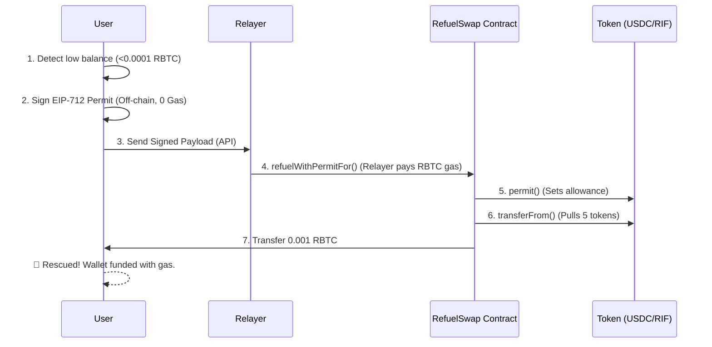

<div align="center">
  <h1>⛽ Rootstock Refuel-Kit</h1>
  <p><b>The "0 Gas" Rescue Widget — Swap ERC20 tokens for RBTC, entirely gasless.</b></p>

  [](https://rootstock.io)
  [](https://typescriptlang.org)
  [](https://soliditylang.org)
  [](https://reactjs.org)
</div>

<br />

## 🚨 The Problem: The Crypto "Death Spiral"
A user bridges their assets (USDC, RIF) to Rootstock, but they forget to bridge RBTC for gas. They are now **stuck**. They have funds, but they cannot execute a single transaction to swap them for gas. They are forced to go back to a centralized exchange, buy RBTC, and send it to their wallet just to make their first move. This is the #1 friction point in onboarding users to a new L2/sidechain.

## 💡 The Solution: Refuel Station
The `Refuel-Kit` is the "Emergency Jerry Can" for the Rootstock ecosystem. 

It allows a stranded user to swap a fixed amount of supported tokens (e.g., 5 USDC or 5 RIF) for enough RBTC (0.001) to act as gas for their future transactions. And because they don't have gas to initiate the swap, **the swap itself is completely gasless**, utilizing EIP-2612 Permits and a Relayer network.

---

## 🚀 Live Deployment (Rootstock Testnet)

The RefuelSwap smart contract is live and fully verified on the Rootstock Testnet:

**Contract Address:** [`0xecb2f47fd664f0376562f2a3b3748b2b4c6f40a7`](https://rootstock-testnet.blockscout.com/address/0xecb2f47fd664f0376562f2a3b3748b2b4c6f40a7)  
**Supported Tokens:** `tUSDC` (EIP-2612 flow) and `tRIF` (Allowance flow)

---

## 🏗️ Architecture & How It Works



---

## 📦 Monorepo Packages

This project is a modern Turborepo containing everything needed to deploy and integrate the gasless rescue flow.

| Package | Role | Details |
|---------|------|---------|
| `packages/contracts` | **Smart Contracts** | Foundry-based Solidity contracts (`RefuelSwap.sol`). Implements `refuelWithPermit` and signature recovery. |
| `packages/sdk` | **TypeScript SDK** | Handles building EIP-712 typed data signatures, wallet client interaction, and relay submission (`RefuelClient`). |
| `packages/ui-kit` | **React Component** | Provides a beautiful, drop-in `<RefuelWidget />` that auto-detects low balances and handles the entire UX flow. |
| `apps/rescue-station`| **Demo dApp** | A Next.js front-end implementing a "Diagnostic Scanner" to check wallet health and embed the rescue widget. |

---

## 💻 Quick Start (Running Locally)

To develop locally or test the Demo dApp:

```bash
# 1. Install dependencies
pnpm install

# 2. Build the SDK and UI-Kit packages
pnpm build

# 3. Start the Rescue Station demo
cd apps/rescue-station 
pnpm dev
```
Open [http://localhost:3000](http://localhost:3000) to view the Rescue Station.

---

## 🧩 Embedding the Widget in Your dApp

The `RefuelWidget` is designed to be completely plug-and-play. You can drop it anywhere in your dApp, and it will remain hidden until it detects that the user is low on gas (<0.0001 RBTC).

```tsx
import { RefuelWidget } from "@rootstock-kits/refuel-ui";
import { useWalletClient, useAccount } from "wagmi";

export function App() {
  const { data: walletClient } = useWalletClient();
  const { address } = useAccount();

  return (
    <div>
      {/* Your App Content */}
      <MyDeFiApp />

      {/* Drop-in Rescue Widget */}
      <RefuelWidget
        address={address}
        walletClient={walletClient}
        chainId={31} // 30 Mainnet, 31 Testnet
        allowedTokens={["USDC", "RIF"]}
        threshold={0.0001} // RBTC
        onSuccess={(txHash) => console.log("Gas Tank Filled!", txHash)}
      />
    </div>
  );
}
```

---

## � Modifying Smart Contracts

Contracts are built using Foundry. To run tests or deploy your own relayer endpoints:

```bash
cd packages/contracts

# Run entire test suite (17/17 passing)
forge test -vvv

# Deploy to testnet
forge script script/Deploy.s.sol:DeployRefuelSwap --rpc-url rootstock_testnet --broadcast --legacy
```

---

## 📋 Tech Stack

* **Contracts:** Solidity (v0.8.20), Foundry, OpenZeppelin (v5.6.1)
* **SDK:** TypeScript, Viem, EIP-2612, EIP-712 Typed Data
* **UI:** React 18, CSS (Premium Dark/Glassmorphism Design)
* **Demo App:** Next.js 14 (App Router)
* **Monorepo:** Turborepo + PNPM Workspaces

---

## 📄 License

MIT © 2026 Rootstock Refuel-Kit
